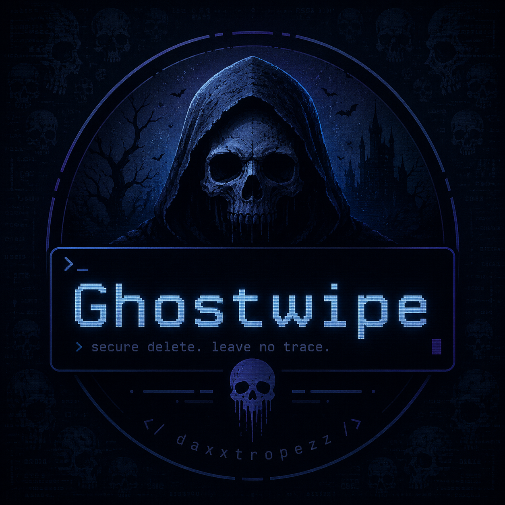
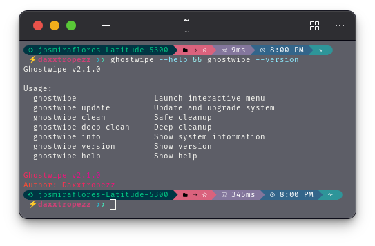
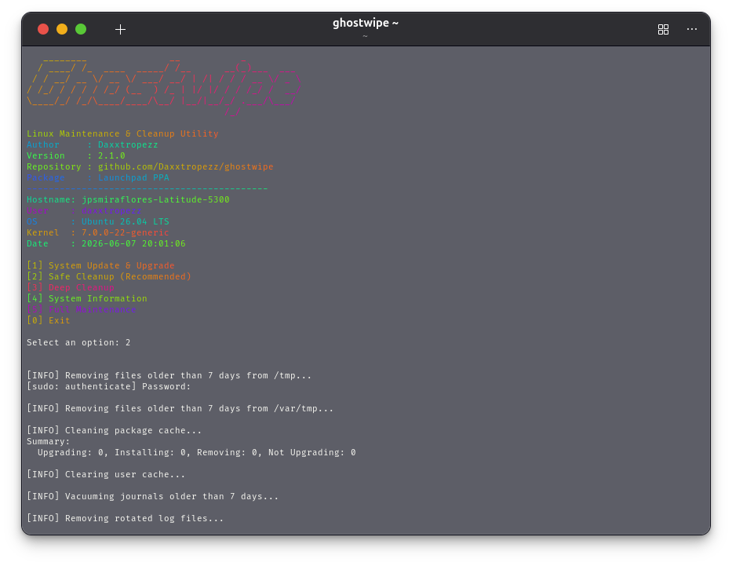

<div align="center">

# ghostwipe

<p>
  
</p>

<p><strong>Cross-Platform Maintenance & Cleanup Utility for Linux and macOS</strong></p>

<p>
  
  
  
  
  
  <a href="https://github.com/Daxxtropezz/ghostwipe/actions/workflows/ci.yml">
    
  </a>
</p>

*A lightweight, transparent, and safety-focused maintenance utility for Debian/Ubuntu Linux and macOS.*

</div>

---

## Overview

`ghostwipe` is an open-source system maintenance utility that provides one consistent CLI for routine cleanup and package maintenance across **Debian/Ubuntu Linux** and **macOS**.

The main `ghostwipe` CLI automatically detects the host operating system and uses the appropriate platform backend:

| Platform | Package Backend | Cleanup Behavior |
| --- | --- | --- |
| Debian / Ubuntu Linux | APT | APT maintenance, age-bounded `/tmp` and `/var/tmp` cleanup, user cache cleanup, systemd journal vacuum |
| macOS | Homebrew | Homebrew maintenance, per-user temporary-directory cleanup, `~/Library/Caches` cleanup |
| Windows | PowerShell | Not supported by the main CLI |

On macOS, Ghostwipe intentionally leaves unified/system logs to macOS instead of force-deleting them.

> **Windows is separate from the main Ghostwipe CLI.**  
> This repository also contains optional PowerShell maintenance utilities for Windows. They are **repository-only scripts** and are not distributed through the Launchpad PPA or Homebrew tap. See [Windows Repository Utilities](#windows-repository-utilities).

---

## Preview

<p align="center">
  
  
</p>

---

## Features

- Interactive terminal menu
- Direct command-line subcommands
- Automatic Linux/macOS detection
- APT support on Debian/Ubuntu
- Homebrew support on macOS
- Safe and deep cleanup modes
- Age-bounded temporary-file cleanup
- Age-bounded user-cache cleanup
- `--dry-run` preview mode
- Explicit confirmation for deep cleanup
- Persistent per-user logging
- `doctor` diagnostics command
- Optional `figlet`, `lolcat`, `fastfetch`, or `neofetch` integration
- Architecture reporting for Intel/AMD and ARM systems

### Safety Improvements in v2.1.2

Ghostwipe no longer blindly performs operations such as:

```bash
rm -rf /tmp/*
rm -rf /var/tmp/*
rm -rf ~/.cache/*
find /var/log -name "*.log*" -delete
```

Instead, cleanup is bounded by file age and platform-specific directories. Ghostwipe does not manually erase `/var/log` and does not clear macOS unified logs.

---

## Supported Platforms

The main `ghostwipe` CLI supports:

| Platform | Architecture | Supported |
| --- | --- | :---: |
| Ubuntu / Debian Linux | x86_64 / amd64 | ✅ |
| Ubuntu / Debian Linux | arm64 / aarch64 | ✅ |
| macOS | Intel x86_64 | ✅ |
| macOS | Apple Silicon arm64 | ✅ |

### Linux Requirements

- Debian or Ubuntu
- `apt-get`
- `sudo` for system-level maintenance unless already running as root
- systemd `journalctl` is optional; journal cleanup is skipped if unavailable

### macOS Requirements

- macOS
- Homebrew

Homebrew commands are never executed with `sudo`.

Windows is **not** a supported platform for the main Bash-based `ghostwipe` CLI. Windows functionality is provided separately through repository PowerShell scripts documented later in this README.

---

## Installation

### macOS — Homebrew

Install Ghostwipe from the official tap:

```bash
brew install Daxxtropezz/tap/ghostwipe
```

Then verify:

```bash
ghostwipe --version
ghostwipe doctor
```

The Homebrew formula depends on a modern Bash version and supports both Intel and Apple Silicon Macs.

---

### Linux — Homebrew

If you use Homebrew on Linux, the same formula can be installed with:

```bash
brew install Daxxtropezz/tap/ghostwipe
```

Ghostwipe will still use **APT** for operating-system package maintenance, so Linux operational support currently requires Debian/Ubuntu even when the Ghostwipe executable itself is installed through Homebrew.

---

### Ubuntu — Launchpad PPA

Install through the official PPA:

```bash
sudo add-apt-repository ppa:daxxtropezz/ghostwipe
sudo apt update
sudo apt install ghostwipe
```

---

### Manual Installation

Clone the repository:

```bash
git clone https://github.com/Daxxtropezz/ghostwipe.git
cd ghostwipe
chmod +x ghostwipe
```

Install system-wide:

```bash
sudo install -m 755 ghostwipe /usr/local/bin/ghostwipe
```

On macOS, **Homebrew installation is recommended** so that a modern Bash dependency is provided automatically.

---

## Usage

Launch the interactive menu:

```bash
ghostwipe
```

Update packages:

```bash
ghostwipe update
```

On Linux this runs APT maintenance. On macOS this runs Homebrew update/upgrade/cleanup.

Perform safe cleanup:

```bash
ghostwipe clean
```

Preview it first:

```bash
ghostwipe --dry-run clean
```

Perform deep cleanup:

```bash
ghostwipe deep-clean
```

Deep cleanup requires typing `WIPE`. For automation:

```bash
ghostwipe --yes deep-clean
```

Preview deep cleanup without changing the system:

```bash
ghostwipe --dry-run deep-clean
```

Run package maintenance followed by safe cleanup:

```bash
ghostwipe full
```

Display system information:

```bash
ghostwipe info
```

Run diagnostics:

```bash
ghostwipe doctor
```

Show recent Ghostwipe log entries:

```bash
ghostwipe log
```

Show version:

```bash
ghostwipe --version
```

Show help:

```bash
ghostwipe --help
```

---

## Command Reference

| Command | Description |
| --- | --- |
| `ghostwipe` | Launch interactive mode |
| `ghostwipe update` | Update packages using APT or Homebrew |
| `ghostwipe clean` | Perform safe cleanup |
| `ghostwipe deep-clean` | Perform deeper age-bounded cleanup |
| `ghostwipe full` | Run package update followed by safe cleanup |
| `ghostwipe info` | Display system information |
| `ghostwipe doctor` | Validate required platform dependencies |
| `ghostwipe log` | Show the latest Ghostwipe log entries |
| `ghostwipe version` | Show installed version |
| `ghostwipe help` | Show help |
| `ghostwipe --dry-run <command>` | Preview supported actions |
| `ghostwipe -y deep-clean` | Skip deep-clean confirmation |
| `ghostwipe --yes deep-clean` | Skip deep-clean confirmation |
| `ghostwipe -h`, `--help` | Show help |
| `ghostwipe -v`, `--version` | Show version |

---

## Cleanup Behavior

### Safe Cleanup

**Linux**

- Removes regular files older than 7 days from `/tmp` and `/var/tmp`
- Runs `apt-get autoremove`
- Cleans the APT cache
- Removes user cache files older than 30 days
- Vacuums systemd journal entries older than 7 days when `journalctl` is available

**macOS**

- Removes files older than 7 days from the current user's macOS temporary directory
- Runs `brew cleanup --prune=7`
- Removes files older than 30 days from `~/Library/Caches`
- Does not manually erase macOS unified/system logs

### Deep Cleanup

Deep cleanup is more aggressive but remains bounded.

**Linux**

- Removes regular files older than 1 day from `/tmp` and `/var/tmp`
- Removes unused APT dependencies and cleans package cache
- Removes user cache files older than 7 days
- Vacuums systemd journal entries older than 1 day when available

**macOS**

- Removes files older than 1 day from the current user's macOS temporary directory
- Runs `brew cleanup --prune=1`
- Removes files older than 7 days from `~/Library/Caches`
- Does not manually erase macOS unified/system logs

---

## Logs

Ghostwipe records its own activity in a per-user state directory.

On Linux:

```text
~/.local/state/ghostwipe/ghostwipe.log
```

On macOS:

```text
~/Library/Application Support/Ghostwipe/ghostwipe.log
```

If the normal state directory cannot be created, Ghostwipe falls back to the user's temporary directory.

View recent entries with:

```bash
ghostwipe log
```

---

## Dry Run

Before performing cleanup, you can inspect what Ghostwipe intends to do:

```bash
ghostwipe --dry-run clean
ghostwipe --dry-run deep-clean
```

Package manager commands are printed instead of executed in dry-run mode. Files targeted by cleanup are listed without being deleted.

---

## Safety Notice

Ghostwipe is designed to be safer than a blanket cleanup script, but cleanup utilities can still remove data applications expect to cache temporarily.

For important servers, development machines, or production systems:

- run `ghostwipe --dry-run clean` first;
- review the listed files;
- avoid unattended deep cleanup until you understand its behavior;
- keep normal backups and recovery procedures.

Ghostwipe does not replace operating-system lifecycle management, monitoring, backups, or vendor-specific maintenance tools.

---

## Windows Repository Utilities

> **Separate from the main Ghostwipe distribution**
>
> The Windows PowerShell utilities in this repository are **not part of the Launchpad PPA package or the Homebrew tap**. Installing `ghostwipe` through APT, the Launchpad PPA, or Homebrew does not install or expose these Windows scripts.
>
> They are repository-based companion utilities intended to be run directly from a local copy of the Ghostwipe project.

The Windows utilities currently consist of:

- `scripts/windows-maintenance.ps1` — interactive Windows maintenance menu
- `scripts/update-windows-apps.ps1` — WinGet application update helper used directly or by the maintenance menu

The Windows scripts do not turn the main Bash-based `ghostwipe` CLI into a Windows command. They are separate PowerShell utilities maintained in the same project repository.

### Windows Requirements

- Windows
- Windows PowerShell 5.1 or later
- WinGet (`winget.exe`) for application updates
- Administrator access when Windows requests elevation for system-level maintenance
- A local Ghostwipe repository directory containing the PowerShell scripts under `scripts/`

### Obtaining the Windows Scripts

The Windows scripts are intended to be executed **from within the Ghostwipe repository directory**.

There are two supported ways to obtain them.

#### Option 1 — Clone the Entire Project

```powershell
git clone https://github.com/Daxxtropezz/ghostwipe.git
cd ghostwipe
```

The required scripts should then be available under:

```text
.\scripts\windows-maintenance.ps1
.\scripts\update-windows-apps.ps1
```

#### Option 2 — Download the Scripts into the Repository

If you already have the Ghostwipe repository directory, download both PowerShell files into its `scripts` directory:

```text
ghostwipe\
└── scripts\
    ├── windows-maintenance.ps1
    └── update-windows-apps.ps1
```

Keep both files together. `windows-maintenance.ps1` expects `update-windows-apps.ps1` to be located beside it when the application-update option is selected.

> Running the maintenance script as an unrelated standalone file outside the Ghostwipe repository layout is not the supported usage model.

### Windows Maintenance Menu

From the **Ghostwipe repository root**, launch:

```powershell
powershell.exe -NoProfile -ExecutionPolicy Bypass -File ./scripts/windows-maintenance.ps1
```

The script opens an interactive menu:

```text
==============================================
       Ghostwipe Windows Maintenance
==============================================

  [1] Update installed applications
  [2] Clear TEMP, Windows Temp, and Prefetch
  [3] Empty Recycle Bin
  [4] Repair Windows (SFC -> DISM -> SFC)
  [5] Run all maintenance
  [0] Exit

Select an option:
```

#### Option 1 — Update Installed Applications

Uses the separate `update-windows-apps.ps1` helper to update installed applications through WinGet.

The updater checks for WinGet and then runs:

```text
winget upgrade --all --silent --accept-package-agreements --accept-source-agreements --include-unknown
```

Example output when no installed applications require an update:

```text
[Ghostwipe] Checking for WinGet...
[Ghostwipe] Checking for available application updates...
No installed package found matching input criteria.
[Ghostwipe] Application update process completed successfully.
```

The maintenance menu itself does not need to be launched as Administrator for this option. Individual application installers may still display a Windows UAC prompt if their own installation process requires elevation.

#### Option 2 — Clear Temporary Files

Clears contents from:

```text
%TEMP%
C:\Windows\Temp
C:\Windows\Prefetch
```

Files that are locked or currently in use are skipped rather than causing the entire cleanup operation to fail.

Cleaning `C:\Windows\Temp` and `C:\Windows\Prefetch` requires administrator privileges. If the menu was launched normally, Ghostwipe requests elevation through Windows UAC when this option is selected.

> Clearing Prefetch data is not normally required for routine Windows operation and may temporarily make some application launches slower while Windows rebuilds its prefetch information.

#### Option 3 — Empty Recycle Bin

Uses PowerShell to empty the Windows Recycle Bin:

```text
Clear-RecycleBin -Force
```

If the Recycle Bin is already empty, the script continues without treating that condition as a fatal error.

#### Option 4 — Repair Windows

Runs the Windows repair sequence in this order:

```text
sfc /scannow
DISM /Online /Cleanup-Image /RestoreHealth
sfc /scannow
```

The first SFC scan checks and attempts to repair protected Windows system files.

DISM then checks the Windows component store and repairs the system image when required.

SFC runs again after DISM so protected system files can be checked against the repaired component store.

This operation requires administrator privileges. Ghostwipe requests elevation through Windows UAC when necessary.

#### Option 5 — Run All Maintenance

Runs the available Windows maintenance tasks in sequence:

1. Update installed applications
2. Clear temporary files
3. Empty the Recycle Bin
4. Run the SFC → DISM → SFC repair sequence

Because this selection includes system-level cleanup and Windows repair commands, administrator elevation is requested through UAC when needed.

### Administrator Privileges on Windows

The Windows maintenance menu does **not** require Administrator privileges simply to start.

Run it normally:

```powershell
powershell.exe -NoProfile -ExecutionPolicy Bypass -File ./scripts/windows-maintenance.ps1
```

When an administrator-only selection is chosen, Ghostwipe requests elevation through Windows UAC and relaunches that selected operation with the required permissions.

This avoids requiring every user to manually open PowerShell as Administrator before they can view or use the menu.

If UAC elevation is declined, the administrator-only action is not performed.

### Run the Application Updater Directly

The WinGet helper can also be run directly from the repository root:

```powershell
powershell.exe -NoProfile -ExecutionPolicy Bypass -File ./scripts/update-windows-apps.ps1
```

It is intended to remain inside the repository's `scripts` directory.

The updater:

- checks whether `winget.exe` is available;
- checks installed applications for available upgrades;
- accepts WinGet package and source agreements automatically;
- attempts to upgrade all supported installed packages;
- reports failures using concise `[Ghostwipe]` messages instead of requiring administrator privileges before the script can start.

### Windows Safety Notes

The Windows maintenance utilities perform real system maintenance operations.

Before using the cleanup or repair options:

- save active work;
- allow applications using temporary files to close normally when possible;
- understand that files currently in use may be skipped;
- do not interrupt SFC or DISM while they are actively repairing Windows;
- keep normal backups and recovery procedures for important systems.

The Windows PowerShell utilities do not replace Windows Update, endpoint management, backups, malware protection, or vendor-specific repair tools.


---

## Project Goals

Ghostwipe aims to remain:

- Open source
- Easy to audit
- Lightweight
- Safe by default
- Automation-friendly
- Cross-platform where behavior can be implemented safely
- Distributed through native or familiar package channels

The Windows repository utilities follow the same transparency and safety goals while remaining separate from the packaged Linux/macOS Ghostwipe CLI.

---

## Contributing

Contributions, bug reports, feature requests, and pull requests are welcome.

Repository:

https://github.com/Daxxtropezz/ghostwipe

---

## Author

**Daxxtropezz**

GitHub: https://github.com/Daxxtropezz

Launchpad: https://launchpad.net/~daxxtropezz

---

## License

This project is licensed under the MIT License.

See the [LICENSE](LICENSE) file for details.
